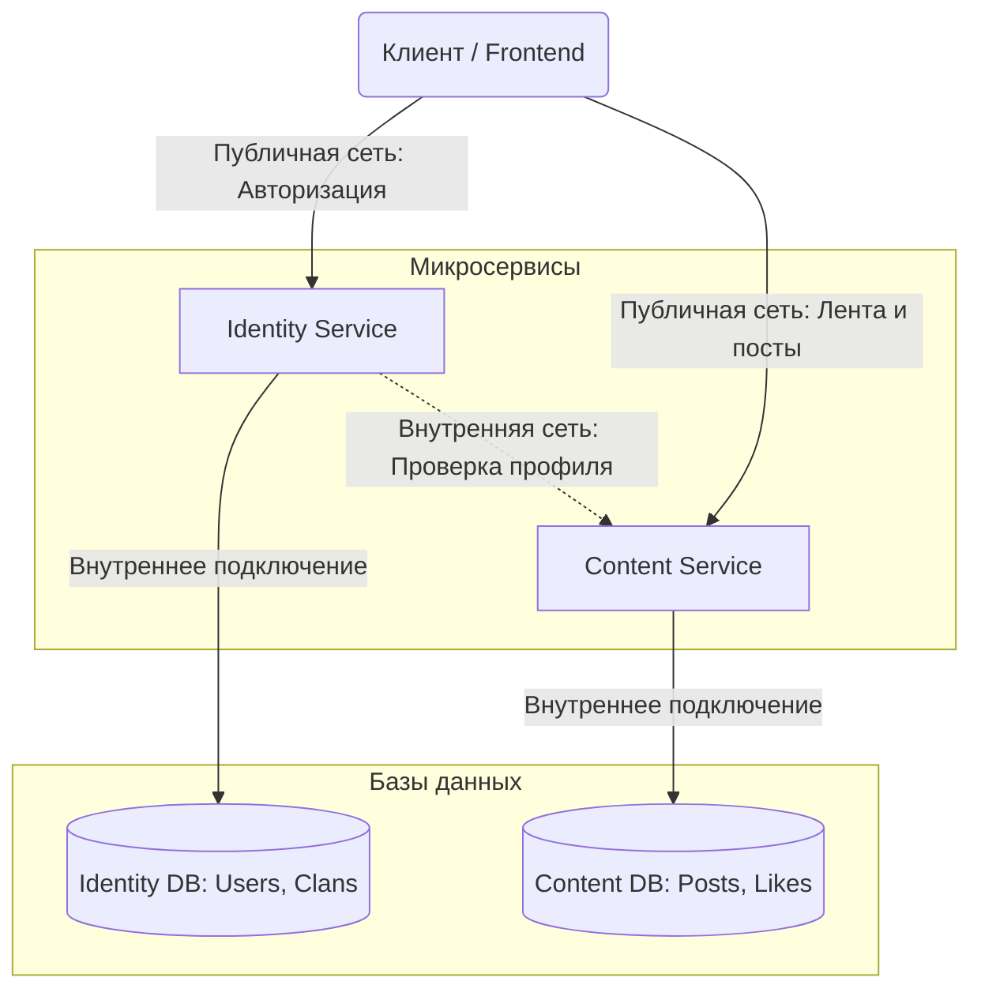
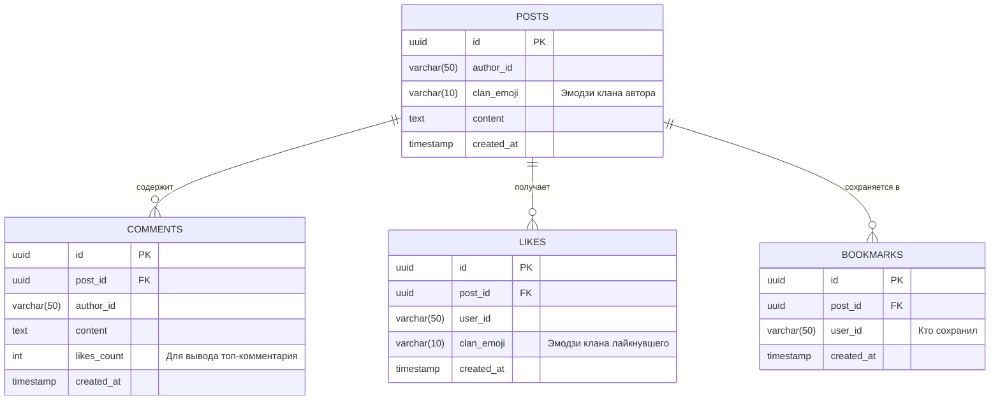

# Микросервисная социальная сеть (Микроблогинг)

## Сфера приложения
Проект представляет собой минималистичную социальную сеть для молодежи и локальных комьюнити. Главная ценность — строго хронологическая лента без алгоритмов, возможность вступления в неформальные "кланы" по выбранному эмодзи-аватару при регистрации, и удобная система дискуссий (по умолчанию отображается только один самый популярный комментарий).

## Архитектурная схема взаимодействия

## ER-диаграмма базы данных (Content Service)

